```mermaid
flowchart TB
    subgraph current["PKHeX_Raid_Plugin.csproj"]
        MAIN["<b>📦&nbsp;PKHeX_Raid_Plugin.csproj</b><br/><small>net9.0-windows</small>"]
        click MAIN "#pkhex_raid_pluginpkhex_raid_plugincsproj"
    end

```

# Projects and dependencies analysis

This document provides a comprehensive overview of the projects and their dependencies in the context of upgrading to .NETCoreApp,Version=v10.0.

## Table of Contents

- [Executive Summary](#executive-Summary)
  - [Highlevel Metrics](#highlevel-metrics)
  - [Projects Compatibility](#projects-compatibility)
  - [Package Compatibility](#package-compatibility)
  - [API Compatibility](#api-compatibility)
- [Aggregate NuGet packages details](#aggregate-nuget-packages-details)
- [Top API Migration Challenges](#top-api-migration-challenges)
  - [Technologies and Features](#technologies-and-features)
  - [Most Frequent API Issues](#most-frequent-api-issues)
- [Projects Relationship Graph](#projects-relationship-graph)
- [Project Details](#project-details)

  - [PKHeX_Raid_Plugin\PKHeX_Raid_Plugin.csproj](#pkhex_raid_pluginpkhex_raid_plugincsproj)

## Executive Summary

### Highlevel Metrics

| Metric | Count | Status |
| :--- | :---: | :--- |
| Total Projects | 1 | All require upgrade |
| Total NuGet Packages | 6 | 1 need upgrade |
| Total Code Files | 42 |  |
| Total Code Files with Incidents | 15 |  |
| Total Lines of Code | 16076 |  |
| Total Number of Issues | 5119 |  |
| Estimated LOC to modify | 5115+ | at least 31.8% of codebase |

### Projects Compatibility

| Project | Target Framework | Difficulty | Package Issues | API Issues | Est. LOC Impact | Description |
| :--- | :---: | :---: | :---: | :---: | :---: | :--- |
| [PKHeX_Raid_Plugin\PKHeX_Raid_Plugin.csproj](#pkhex_raid_pluginpkhex_raid_plugincsproj) | net9.0-windows | 🟡 Medium | 3 | 5115 | 5115+ | ClassLibrary, Sdk Style = True |

### Package Compatibility

| Status | Count | Percentage |
| :--- | :---: | :---: |
| ✅ Compatible | 5 | 83.3% |
| ⚠️ Incompatible | 0 | 0.0% |
| 🔄 Upgrade Recommended | 1 | 16.7% |
| ***Total NuGet Packages*** | ***6*** | ***100%*** |

### API Compatibility

| Category | Count | Impact |
| :--- | :---: | :--- |
| 🔴 Binary Incompatible | 4853 | High - Require code changes |
| 🟡 Source Incompatible | 262 | Medium - Needs re-compilation and potential conflicting API error fixing |
| 🔵 Behavioral change | 0 | Low - Behavioral changes that may require testing at runtime |
| ✅ Compatible | 6548 |  |
| ***Total APIs Analyzed*** | ***11663*** |  |

## Aggregate NuGet packages details

| Package | Current Version | Suggested Version | Projects | Description |
| :--- | :---: | :---: | :--- | :--- |
| Costura.Fody | 5.7.0 |  | [PKHeX_Raid_Plugin.csproj](#pkhex_raid_pluginpkhex_raid_plugincsproj) | ✅Compatible |
| Microsoft.Z3 | 4.12.0 |  | [PKHeX_Raid_Plugin.csproj](#pkhex_raid_pluginpkhex_raid_plugincsproj) | ✅Compatible |
| Newtonsoft.Json | 13.0.3 | 13.0.4 | [PKHeX_Raid_Plugin.csproj](#pkhex_raid_pluginpkhex_raid_plugincsproj) | NuGet package upgrade is recommended |
| PKHeX.Core | 25.6.9 |  | [PKHeX_Raid_Plugin.csproj](#pkhex_raid_pluginpkhex_raid_plugincsproj) | ✅Compatible |
| System.Net.Http | 4.3.4 |  | [PKHeX_Raid_Plugin.csproj](#pkhex_raid_pluginpkhex_raid_plugincsproj) | NuGet package functionality is included with framework reference |
| System.Text.RegularExpressions | 4.3.1 |  | [PKHeX_Raid_Plugin.csproj](#pkhex_raid_pluginpkhex_raid_plugincsproj) | NuGet package functionality is included with framework reference |

## Top API Migration Challenges

### Technologies and Features

| Technology | Issues | Percentage | Migration Path |
| :--- | :---: | :---: | :--- |
| Windows Forms | 4845 | 94.7% | Windows Forms APIs for building Windows desktop applications with traditional Forms-based UI that are available in .NET on Windows. Enable Windows Desktop support: Option 1 (Recommended): Target net9.0-windows; Option 2: Add <UseWindowsDesktop>true</UseWindowsDesktop>; Option 3 (Legacy): Use Microsoft.NET.Sdk.WindowsDesktop SDK. |
| Windows Forms Legacy Controls | 523 | 10.2% | Legacy Windows Forms controls that have been removed from .NET Core/5+ including StatusBar, DataGrid, ContextMenu, MainMenu, MenuItem, and ToolBar. These controls were replaced by more modern alternatives. Use ToolStrip, MenuStrip, ContextMenuStrip, and DataGridView instead. |
| GDI+ / System.Drawing | 241 | 4.7% | System.Drawing APIs for 2D graphics, imaging, and printing that are available via NuGet package System.Drawing.Common. Note: Not recommended for server scenarios due to Windows dependencies; consider cross-platform alternatives like SkiaSharp or ImageSharp for new code. |
| Legacy Configuration System | 9 | 0.2% | Legacy XML-based configuration system (app.config/web.config) that has been replaced by a more flexible configuration model in .NET Core. The old system was rigid and XML-based. Migrate to Microsoft.Extensions.Configuration with JSON/environment variables; use System.Configuration.ConfigurationManager NuGet package as interim bridge if needed. |

### Most Frequent API Issues

| API | Count | Percentage | Category |
| :--- | :---: | :---: | :--- |
| T:System.Windows.Forms.Label | 567 | 11.1% | Binary Incompatible |
| T:System.Windows.Forms.NumericUpDown | 270 | 5.3% | Binary Incompatible |
| T:System.Windows.Forms.Padding | 230 | 4.5% | Binary Incompatible |
| T:System.Windows.Forms.GroupBox | 224 | 4.4% | Binary Incompatible |
| T:System.Windows.Forms.TextBox | 183 | 3.6% | Binary Incompatible |
| T:System.Windows.Forms.Button | 130 | 2.5% | Binary Incompatible |
| T:System.Windows.Forms.ComboBox | 123 | 2.4% | Binary Incompatible |
| P:System.Windows.Forms.Control.Name | 121 | 2.4% | Binary Incompatible |
| P:System.Windows.Forms.Control.Location | 121 | 2.4% | Binary Incompatible |
| T:System.Windows.Forms.DataGridViewTextBoxColumn | 121 | 2.4% | Binary Incompatible |
| P:System.Windows.Forms.Control.Size | 120 | 2.3% | Binary Incompatible |
| T:System.Windows.Forms.Control.ControlCollection | 119 | 2.3% | Binary Incompatible |
| P:System.Windows.Forms.Control.Controls | 119 | 2.3% | Binary Incompatible |
| M:System.Windows.Forms.Control.ControlCollection.Add(System.Windows.Forms.Control) | 118 | 2.3% | Binary Incompatible |
| P:System.Windows.Forms.Control.TabIndex | 116 | 2.3% | Binary Incompatible |
| P:System.Windows.Forms.Control.Margin | 103 | 2.0% | Binary Incompatible |
| T:System.Windows.Forms.CheckBox | 81 | 1.6% | Binary Incompatible |
| M:System.Windows.Forms.Padding.#ctor(System.Int32) | 62 | 1.2% | Binary Incompatible |
| P:System.Windows.Forms.Label.Text | 57 | 1.1% | Binary Incompatible |
| M:System.Windows.Forms.Padding.#ctor(System.Int32,System.Int32,System.Int32,System.Int32) | 53 | 1.0% | Binary Incompatible |
| M:System.Windows.Forms.Label.#ctor | 51 | 1.0% | Binary Incompatible |
| T:System.Windows.Forms.PictureBox | 51 | 1.0% | Binary Incompatible |
| T:System.Windows.Forms.DataGridView | 47 | 0.9% | Binary Incompatible |
| P:System.Windows.Forms.Label.AutoSize | 44 | 0.9% | Binary Incompatible |
| P:System.Windows.Forms.NumericUpDown.Value | 42 | 0.8% | Binary Incompatible |
| T:System.Drawing.ContentAlignment | 39 | 0.8% | Source Incompatible |
| T:System.Drawing.Bitmap | 36 | 0.7% | Source Incompatible |
| T:System.Windows.Forms.DataGridViewAutoSizeColumnMode | 36 | 0.7% | Binary Incompatible |
| P:System.Windows.Forms.TextBox.Text | 31 | 0.6% | Binary Incompatible |
| T:System.Windows.Forms.DataGridViewCell | 31 | 0.6% | Binary Incompatible |
| P:System.Windows.Forms.DataGridViewCell.Value | 28 | 0.5% | Binary Incompatible |
| T:System.Windows.Forms.Keys | 27 | 0.5% | Binary Incompatible |
| T:System.Windows.Forms.SplitContainer | 25 | 0.5% | Binary Incompatible |
| T:System.Windows.Forms.DialogResult | 24 | 0.5% | Binary Incompatible |
| T:System.Windows.Forms.ComboBoxStyle | 24 | 0.5% | Binary Incompatible |
| T:System.Windows.Forms.DataGridViewCellCollection | 24 | 0.5% | Binary Incompatible |
| P:System.Windows.Forms.DataGridViewRow.Cells | 24 | 0.5% | Binary Incompatible |
| P:System.Windows.Forms.DataGridViewCellCollection.Item(System.Int32) | 24 | 0.5% | Binary Incompatible |
| P:System.Windows.Forms.ButtonBase.Text | 23 | 0.4% | Binary Incompatible |
| P:System.Windows.Forms.ComboBox.SelectedIndex | 20 | 0.4% | Binary Incompatible |
| T:System.Drawing.Font | 18 | 0.4% | Source Incompatible |
| P:System.Windows.Forms.NumericUpDown.Maximum | 18 | 0.4% | Binary Incompatible |
| M:System.Windows.Forms.NumericUpDown.#ctor | 18 | 0.4% | Binary Incompatible |
| T:System.Drawing.Image | 18 | 0.4% | Source Incompatible |
| T:System.Windows.Forms.ComboBox.ObjectCollection | 17 | 0.3% | Binary Incompatible |
| P:System.Windows.Forms.ComboBox.Items | 17 | 0.3% | Binary Incompatible |
| T:System.Windows.Forms.ProgressBar | 17 | 0.3% | Binary Incompatible |
| T:System.Windows.Forms.AnchorStyles | 17 | 0.3% | Binary Incompatible |
| T:System.Drawing.FontStyle | 16 | 0.3% | Source Incompatible |
| P:System.Windows.Forms.ButtonBase.UseVisualStyleBackColor | 15 | 0.3% | Binary Incompatible |

## Projects Relationship Graph

Legend:
📦 SDK-style project
⚙️ Classic project

## Project Details

### PKHeX_Raid_Plugin\PKHeX_Raid_Plugin.csproj

#### Project Info

- **Current Target Framework:** net9.0-windows
- **Proposed Target Framework:** net10.0--windows
- **SDK-style**: True
- **Project Kind:** ClassLibrary
- **Dependencies**: 0
- **Dependants**: 0
- **Number of Files**: 46
- **Number of Files with Incidents**: 15
- **Lines of Code**: 16076
- **Estimated LOC to modify**: 5115+ (at least 31.8% of the project)

#### Dependency Graph

Legend:
📦 SDK-style project
⚙️ Classic project

### API Compatibility

| Category | Count | Impact |
| :--- | :---: | :--- |
| 🔴 Binary Incompatible | 4853 | High - Require code changes |
| 🟡 Source Incompatible | 262 | Medium - Needs re-compilation and potential conflicting API error fixing |
| 🔵 Behavioral change | 0 | Low - Behavioral changes that may require testing at runtime |
| ✅ Compatible | 6548 |  |
| ***Total APIs Analyzed*** | ***11663*** |  |

#### Project Technologies and Features

| Technology | Issues | Percentage | Migration Path |
| :--- | :---: | :---: | :--- |
| Legacy Configuration System | 9 | 0.2% | Legacy XML-based configuration system (app.config/web.config) that has been replaced by a more flexible configuration model in .NET Core. The old system was rigid and XML-based. Migrate to Microsoft.Extensions.Configuration with JSON/environment variables; use System.Configuration.ConfigurationManager NuGet package as interim bridge if needed. |
| GDI+ / System.Drawing | 241 | 4.7% | System.Drawing APIs for 2D graphics, imaging, and printing that are available via NuGet package System.Drawing.Common. Note: Not recommended for server scenarios due to Windows dependencies; consider cross-platform alternatives like SkiaSharp or ImageSharp for new code. |
| Windows Forms Legacy Controls | 523 | 10.2% | Legacy Windows Forms controls that have been removed from .NET Core/5+ including StatusBar, DataGrid, ContextMenu, MainMenu, MenuItem, and ToolBar. These controls were replaced by more modern alternatives. Use ToolStrip, MenuStrip, ContextMenuStrip, and DataGridView instead. |
| Windows Forms | 4845 | 94.7% | Windows Forms APIs for building Windows desktop applications with traditional Forms-based UI that are available in .NET on Windows. Enable Windows Desktop support: Option 1 (Recommended): Target net9.0-windows; Option 2: Add <UseWindowsDesktop>true</UseWindowsDesktop>; Option 3 (Legacy): Use Microsoft.NET.Sdk.WindowsDesktop SDK. |

